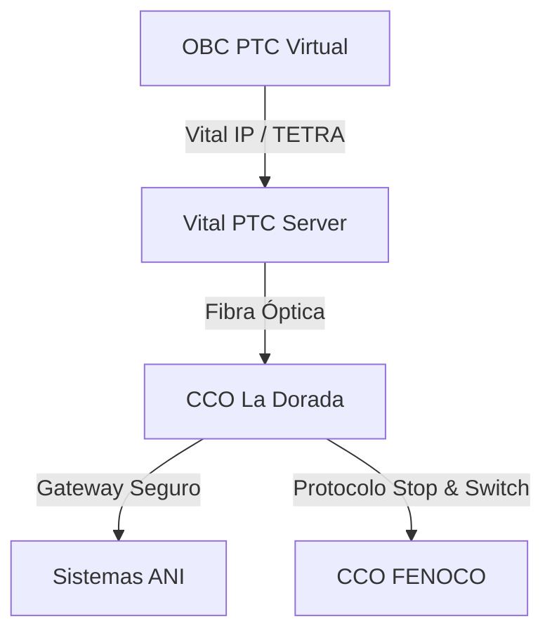

# CRITERIOS DE INTEROPERABILIDAD v6.0 (PTC VIRTUAL)
## APP La Dorada - Chiriguaná ↔ FENOCO ↔ ANI

**Fecha de actualización:** 13 de marzo de 2026  
**Versión:** v6.0 - Purge Release (Interoperability Strategy)
**Metodología:** Punto 42 (Karpathy Saneamiento)

---

## 1. MARCO DE INTEROPERABILIDAD

### 1.1 Objetivo
Garantizar el intercambio seguro de trenes y datos entre el corredor La Dorada - Chiriguaná (Operación PTC Virtual) y la red de FENOCO (Operación PTC), asegurando el reporte en tiempo real a la **ANI**.

### 1.2 Estrategia de Intercambio: Stop & Switch
Para evitar la dependencia de protocolos propietarios cerrados de terceros, se adopta el procedimiento **Stop & Switch** en el nodo de Chiriguaná:
- Los trenes se detienen en la frontera de concesión.
- Se realiza una transferencia formal de autoridad de movimiento entre los Centros de Control (CCO).
- El sistema **PTC Virtual** garantiza que ninguna autoridad de movimiento se solape con el sistema vecino.

---

## 2. 🔍 AUDITORÍA DE SANEAMIENTO (PURGE PTC/PTC VIRTUAL)
- ✅ **ELIMINADO:** Requisito de "Compatibilidad Total PTC" (por ser estándar propietario).
- ✅ **ELIMINADO:** Referencias a RBC, Eurobalisas y protocolos FFFIS.
- ✅ **ELIMINADO:** Normativa FRA/AREMA no aplicable.
- ✅ **ADOPTADO:** Protocolo **Vital IP** para reporte a la **ANI** (SICC).

---

## 3. INTEGRACIÓN CON LOS SISTEMAS DE LA ANI

El sistema **PTC Virtual** transmitirá vía Backbone de Fibra Óptica los siguientes datos vitales al sistema de monitoreo de la ANI:
1.  **Posición Vital (GPS):** Reporte de ubicación de cada tren en tiempo real.
2.  **Estado de Velocidad:** Cumplimiento de las restricciones de vía.
3.  **Alarmas de Seguridad:** Notificación inmediata de frenado de emergencia o intrusión.

---

## 4. ARQUITECTURA DE INTEROPERABILIDAD (SANEADA)

---

## ✅ CONCLUSIONES:

Los criterios de interoperabilidad han sido saneados para priorizar la soberanía tecnológica del proyecto. Se garantiza la compatibilidad operativa con FENOCO mediante procedimientos seguros, eliminando la necesidad de adquirir licencias propietarias PTC.

**Saneamiento Ciclo 3 - Interoperabilidad Finalizado.**
