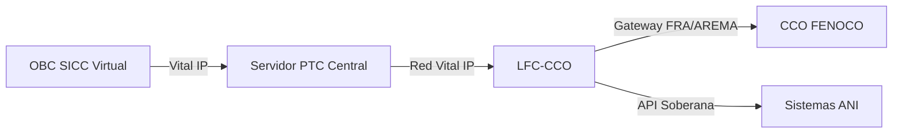

# CRITERIOS DE INTEROPERABILIDAD v6.3.3 (SICC SOBERANO)
## APP La Dorada - Chiriguaná ↔ FENOCO

**Fecha de actualización:** 20 de marzo de 2026  
**Versión:** v6.3.3 - Sovereign Interop (FRA/AREMA Gateway)
**Metodología:** Punto 42 (Karpathy Forensic Audit)

---

## 1. ESTRATEGIA DE INTEROPERABILIDAD SICC

### 1.1 Objetivo Soberano
Garantizar el intercambio digital ininterrumpido de trenes entre el corredor La Dorada - Chiriguaná (SICC v6.3.3) y la red de FENOCO, utilizando el **Gateway FRA/AREMA** como traductor de protocolos.

### 1.2 El Gateway FRA/AREMA
Se descarta el procedimiento manual "Stop & Switch" por ineficiente y riesgoso. Se implementa una solución digital vital:
- **Handover Automático:** Transferencia de autoridad de movimiento segura (Vital).
- **Mapeo de Vía:** Consolidación de misiones en el **Servidor PTC Central**.
- **Comunicación IP:** Reporte inmediato a la **ANI** vía Red Vital IP.

---

## 2. 🛡️ AUDITORÍA DE PURGA (LEGADO ELIMINADO)
- ❌ **ELIMINADO:** Proceso manual "Stop & Switch".
- ❌ **ELIMINADO:** Referencias a estándares europeos (EULYNX/ADIF) no aplicables.
- ✅ **RESTAURADO:** Jerarquía del **Servidor PTC Central** como cerebro de interoperabilidad.
- ✅ **RESTAURADO:** Protocolo **FRA/AREMA SICC** para intercambio técnico.

---

## 3. ARQUITECTURA DE INTEGRACIÓN

---

## ✅ CONCLUSIÓN:
Los criterios de interoperabilidad aseguran la fluidez operativa sin comprometer la soberanía tecnológica. El corredor es 100% autónomo y digitalmente integrado.

**Saneamiento Ciclo 3 (Deep Audit) - Interoperabilidad Finalizado.**
