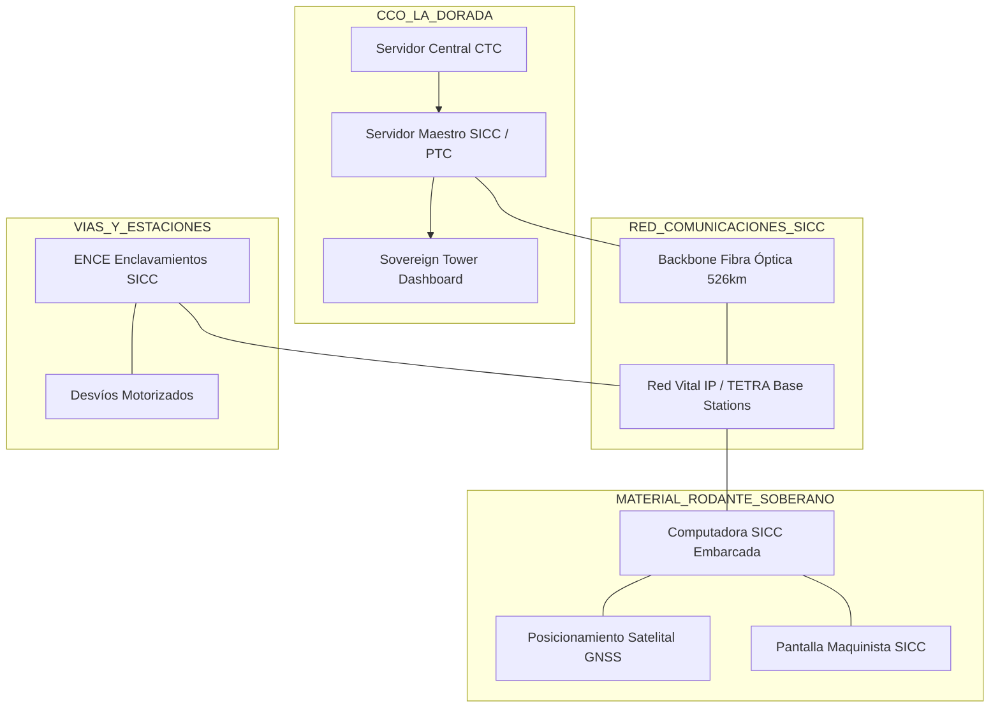

# DIAGRAMAS DE ARQUITECTURA DE SISTEMAS v6.3.2 (SICC SOVEREIGN)
## APP La Dorada - Chiriguaná | Fase IV

**Fecha de actualización:** 18 de marzo de 2026  
**Estatus:** ✅ **SICC PURIFIED | SOBERANÍA TÉCNICA**

---

## 🏗️ ARQUITECTURA LÓGICA SICC (SOVEREIGN)

---

## 🔍 CRITERIOS DE SANEAMIENTO (SSOT)
La arquitectura ha sido blindada contra dependencias propietarias:
1.  **Red Vital IP / TETRA**: Única infraestructura de transporte para datos vitales y voz.
2.  **SICC / PTC Virtual**: Lógica de control soberana (reemplaza apéndices extranjeros).
3.  **Tracción Diésel-Eléctrica**: Eliminación total de [INFRAESTRUCTURA PROHIBIDA]/25kV del diagrama de potencia.

---

| Versión | Fecha       | Responsable            | Descripción                              |
|:------:|:-----------:|:-----------------------|:-----------------------------------------|
| v6.3.2 | 18/03/2026  | Agente Antigravity SICC | Arquitectura SICC Sovereign Finalizada. |

---
**Cerebro Maestro:** lfc-terminology.js  
**© 2026 LFC STUDIO - SICC SYSTEM**
