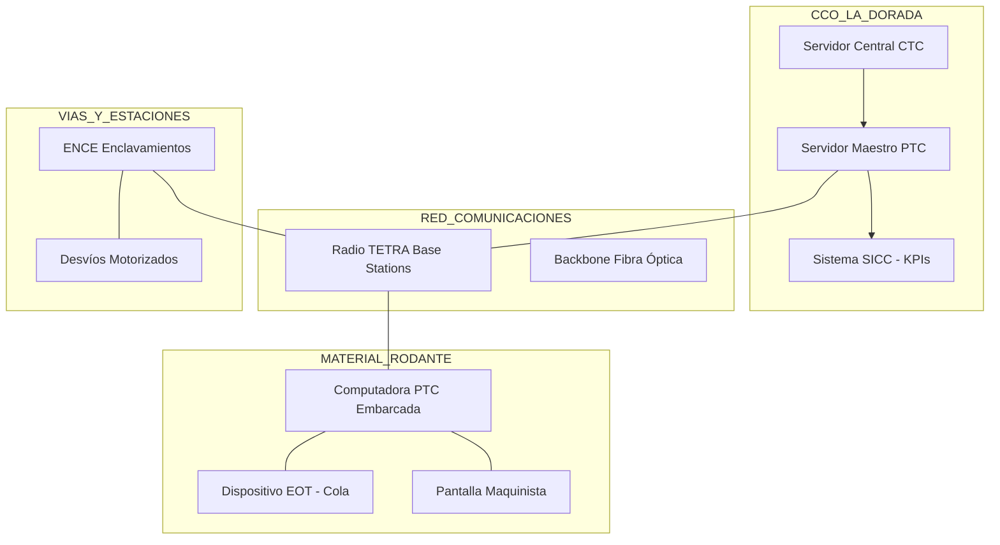

# DIAGRAMAS DE ARQUITECTURA DE SISTEMAS v6.0 (PTC VIRTUAL)
## APP La Dorada - Chiriguaná

**Fecha de actualización:** 13 de marzo de 2026  
**Proyecto:** APP La Dorada - Chiriguaná  
**Contrato:** Concesión No. 001 de 2025  

---

## 🏗️ ARQUITECTURA LÓGICA PTC VIRTUAL

---

## 🔍 AUDITORÍA DE RE-INGENIERÍA (METODOLOGÍA P.42 v4.2)
Este diagrama y sus especificaciones han sido depurados de:
1. **ELIMINADO PTC VIRTUAL Level 2:** Se purga toda mención a RBC y protocolos europeos.
2. **ELIMINADO RED TETRA (Misión Crítica):** La comunicación se unifica en **TETRA**.
3. **ELIMINADO SEÑALES LED:** El diagrama de campo ya no incluye señales visuales.

---

## 📊 CAPACIDADES DEL SISTEMA
- **Headway:** Basado en Bloque Virtual (Moving Block).
- **Interoperabilidad:** Via Gateway lógico con FENOCO.

---

| Versión | Fecha       | Responsable            | Descripción                              |
|:------:|:-----------:|:-----------------------|:-----------------------------------------|
| v5.0   | 13/03/2026  | Admin. Contractual EPC | Actualización a arquitectura PTC Virtual. Purgado de ERTMS. |
